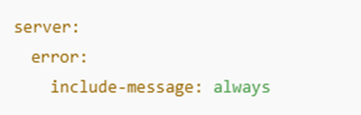

## 1.	Clase ResponseEntity

La clase ResponseEntity en Spring Boot permite gestionar las respuestas HTTP de manera precisa, facilitando la especificación de códigos de respuesta. La clase Controller se encarga de procesar estas respuestas, retornando típicamente un código 200 (OK) en caso de éxito.

### Ejemplo: 

## 2.	Clase ResponseStatusException

Para el manejo de errores en tiempo de ejecución, Spring Boot permite el uso de ResponseStatusException, lo que ayuda a gestionar situaciones donde una instrucción falla. Este enfoque es esencial para proporcionar información adecuada al frontend, mejorando la validación de datos.

### Ejemplo:

•	En un método de servicio, se valida la existencia de un-ID antes de actualizar un registro

•	Para personalizar los mensajes de error, se debe configurar el archivo application.yml:

•	Para incluir el ID en el mensaje de error:

## 3.	Integración en el Controller

El método de actualización también debe ser agregado al controlador usando @PutMapping:

Finalmente, se sugiere utilizar herramientas como Postman para probar las funcionalidades y verificar el manejo de errores y respuestas.
